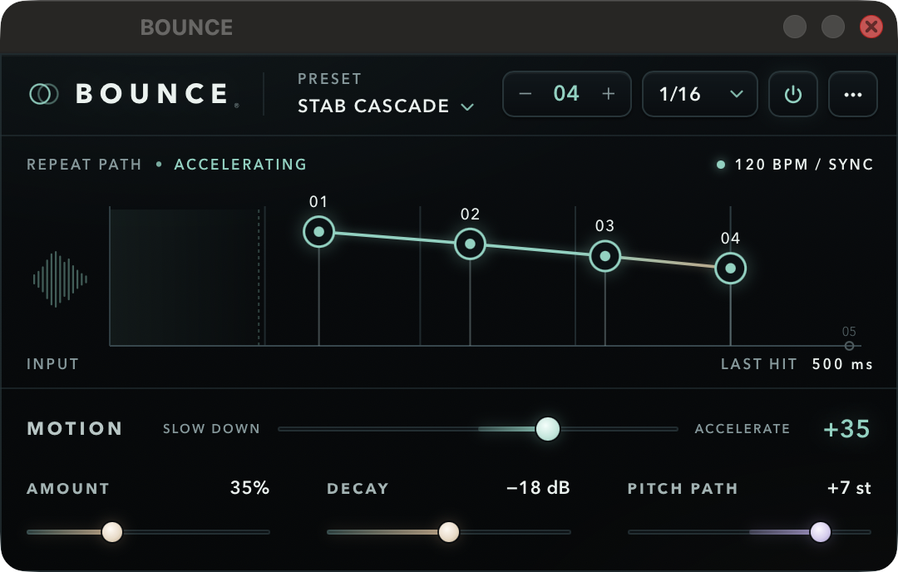

# BOUNCE

One input hit becomes a finite, explicitly scheduled sequence of new hits — each with its own
time, loudness and pitch. A live insert for stabs, percussion, vocal chops and pre-drop rolls.
Built from the owner's V1 build specification (v1.2, 26 Sep 2026).



JUCE 9.0.0 · C++20 · VST3 (macOS/Windows) · AU (macOS) · Standalone · zero latency · 24 s tail.
Identity (frozen): `PRODUCT_NAME "BOUNCE"`, `PLUGIN_CODE Bnce`, `PLUGIN_MANUFACTURER_CODE Naam`,
`BUNDLE_ID com.naaman.bounce`, `stateSchemaVersion 3`.

## Build

```bash
scripts/build-macos.sh
```

Universal arm64 + x86_64, minimum macOS 10.13. Configures, builds VST3/AU/Standalone and the test
suite, runs the tests, pluginval (strictness 10) and auval, and writes `dist/BOUNCE-1.3.0-macOS.zip`.
Built plug-ins are also copied into `~/Library/Audio/Plug-Ins`.

Windows: built by CI — `.github/workflows/windows.yml` (Actions → Windows → Run workflow) compiles with
MSVC, runs the full test suite, packs an Inno Setup installer, installs and uninstalls it on the runner,
and uploads `BOUNCE-<version>-Windows-Setup.zip`; `packaging/fetch-windows-ci.sh` downloads it into
`dist/`. Local alternative: `scripts\build-windows.ps1` (VS 2022; not run).

Manual:

```bash
cmake -B build -DCMAKE_BUILD_TYPE=Release
cmake --build build --target Bounce_VST3 Bounce_AU Bounce_Standalone BounceTests -j
build/BounceTests_artefacts/Release/BounceTests            # optional filter: pattern | engine | state
cmake -B build-asan -DCMAKE_BUILD_TYPE=Debug -DBOUNCE_SANITIZERS=ON -DBOUNCE_COPY_AFTER_BUILD=OFF
build/BounceShot_artefacts/Release/BounceShot 8 1          # real editor fed live hits, for screenshots
```

## Signal flow

```
input ──┬──────────────────────────────────────────────── dry (never delayed) ──┐
        │                                                                        ├─ dry·(wetOnly?0:1) + amount·wet ─ × output ─ enabled crossfade ─ out
        └─ max(|L|,|R|) → onset detector ──trigger──┐                           │
           8 ms history ring ──────────────────────►├─ event (1 of 16): capture L samples (stereo),
           live input ─────────────────────────────►┘   then play it once per scheduled tap:
                                                        delay, gain, varispeed rate snapshotted at the hit ──► wet
```

- **Detector** (`OnsetDetector`): instant-attack/1 ms-release peak envelope vs. a 30 ms envelope of that
  envelope; fires on a rising sample above THRESHOLD with ≥ 6 dB contrast, then disarms until the
  envelope falls 6 dB under the threshold or below the slow envelope; RETRIGGER is a second guard.
  An impulse triggers on its own sample at any rate.
- **Schedule** (`Pattern::computeSchedule`): `B` from host BPM (fallback 120) × division, or FREE ms;
  `T = N·B`; `t_i = T·(8·v_i/N)^(2^(−motion/100))`; 16 s cap; source safety (first tap ≥ source + 5 ms,
  common shift); 12 ms minimum gap. Level `trim + decay·q`, pitch `clamp(trim + path·q, ±12)`,
  `q = (i−1)/(N−1)`. The editor draws the output of this same function.
- **Playback** (`BounceEngine`, `Resampler`): each tap reads the captured excerpt with its onset aligned to
  `hit + delay`; 0.5 ms entrance / 5 ms exit fade on the excerpt; varispeed with a Kaiser windowed-sinc
  (8 zero crossings, cutoff `min(1, 1/rate)`), exact copy when unpitched. No feedback anywhere.
- **Live vs. snapshot**: AMOUNT, WET ONLY, OUTPUT, ENABLED are smoothed over 5 ms and act on sounding
  audio. Everything else is read once per block and snapshotted at a trigger; sounding events keep their
  own schedule and tempo.
- **Transport**: stop, seek and loop jump fade sounding events out in 5 ms. Host bypass passes audio and
  clears all events. Restoring state clears events before the next block.

## Parameters (permanent IDs — 46 from the V1 contract + 2 in 1.1 + 9 in 1.3 = 57)

| ID | Range / default | |
|---|---|---|
| `enabled` | off/on · on | off passes input unchanged, wet fades 5 ms |
| `amount` | 0–100 % · 35 | additive wet level |
| `wetOnly` | off/on · off | dry removed, 5 ms smoothing |
| `outputDb` | −18…+12 dB · 0 | smoothed 5 ms |
| `repeats` | 2–8 · 4 | active slots |
| `sync` | off/on · on | host tempo or free ms |
| `division` | 1/4, 1/8 dotted, 1/8, 1/8 triplet, 1/16 dotted, 1/16, 1/16 triplet, 1/32 · 1/16 | order frozen |
| `freeMs` | 30–1000 ms · 125 | interval when sync is off |
| `motion` | −100…+100 · 0 | −100 SLOW DOWN, +100 ACCELERATE |
| `decayDb` | −36…0 dB · −18 | progressive attenuation |
| `pitchPathSt` | −12…+12 st · 0 | progressive pitch |
| `sourceMs` | 20–1000 ms · 100 | capture window incl. 8 ms pre-roll |
| `thresholdDb` | −48…−6 dBFS · −24 | detector floor |
| `retriggerMs` | 20–500 ms · 90 | minimum trigger spacing |
| `tap{1..8}On` | off/on · on | mutes only that slot |
| `tap{1..8}Time` | 0.005–1.0 · i/8 | position on the 8-interval master grid |
| `tap{1..8}LevelDb` | −48…+6 dB · 0 | trim |
| `tap{1..8}PitchSt` | −12…+12 st · 0 | trim |
| `choke` *(1.1)* | off/on · off | a new hit cuts the previous hit's repeats (5 ms fade from the onset sample) |
| `quantize` *(1.3)* | off/on · off | repeats lock to the host grid: each hit's taps move by its distance to the nearest RATE grid line (pushed by whole intervals if that would beat the capture). Needs SYNC and a playing host |
| `tap{1..8}Reverse` *(1.3)* | off/on · off | that repeat plays the hit backwards: its transient lands on the tap's time and the tail swells in before it; source safety accounts for the swell |
| `tightMs` *(1.1)* | 0–200 ms · 0 = off | each repeat is only the first tightMs of the hit: capture = 8 ms + tightMs, faded over its last 60 % |

**Options (1.1).** CHOKE and TIGHT exist so BOUNCE can also play *rolls and ratchets* rather than echoes. Both
default off: the 1.0 sound, the first twelve presets and every schema-1 project are unchanged (tested).

## Factory presets (63, in 9 categories)

Index order is frozen (host program number and saved preset index); new presets are only appended.
The editor's menu shows categories on the left and that category's presets on the right; ‹ › step through
the whole list in menu order.

| Category | Presets |
|---|---|
| ESSENTIALS | Straight Four · Tiny Double · Eighth Echo · Dotted Bounce · Triplet Taps · Quarter Answer · Sixteenth Slap · Locked Grid *(Q)* |
| ROLLS & FILLS | Accelerating Fill · Snare Run · Snare Build 8 · Tom Rush · Slowing Roll · Half-Time Roll · Buzz Roll |
| PITCH | Stab Cascade · Pitch Ladder Up · Pitch Ladder Down · Octave Jump · Fifth Stack · Pentatonic Fall · Wobble Tune · Dive Bomb |
| ECHO & SPACE | Slow Falling Echo · Dark Downroll · Canyon Throw · Long Drift · Ghost Tail · Reverse Swell · Fading Stairs |
| GROOVE | Percussion Triplets · Afro Shuffle · Clave Answer · Shaker Swing · Conga Call · Offbeat Skip · Polyrhythm 3:4 |
| VOCAL & CHOPS | Vocal Answer · Chop Stutter · Vox Call Up · Vox Throw Down · Word Repeat · Breath Echo · Locked Vocal Echo *(Q)* |
| CHOKE & TIGHT | Choke Roll · Tight Ratchet · Bouncing Ball · Hat Ratchet · Tight Double · Machine Gun · Choke Triplets · Dry Clicks |
| REVERSE | Swell Into Beat · Backwards Answer · Mirror Bounce · Reverse Ladder · Suck Back Snare · Reverse Roll |
| FX & DROPS | Pre-Drop Rush · Riser Ladder · Drop Stutter · Glitch Scatter · Tape Stop Fall |

Every preset sets every parameter and is tested: valid tap order, no source-safety shift at 120 BPM, audibly
different from every other preset, and output within +6 dB of the input peak on a kick and on a tonal stab.

## Editor

540 × 312 logical (resizable 75–200 %, fixed aspect, scale saved with the state). WebView page embedded in
BinaryData — no network. Top strip: wordmark, preset, REPEATS, RATE/SYNC/FREE, enable, settings. One graph:
x = actual repeat time, y = effective gain, shaded capture window, dormant slots as grey markers, muted taps
as dashed rings; balls flash when their real repeat plays. Drag a ball (shift = fine) for time and level;
click for the tap popover (time, level, pitch, on); arrows / shift-arrows, M mutes, double-click resets.
Settings: SOURCE, TIGHT, THRESHOLD, RETRIGGER, FREE RATE, OUTPUT, CHOKE, SYNC, WET ONLY, SNAP, RESET PATTERN and
diagnostics (triggers / events / dropped). If the web view cannot load within 8 s, a native fallback with
JUCE's generic editor appears.

## Verification (macOS, Apple silicon, 7 Oct 2026, v1.3.0)

| | Result |
|---|---|
| Test suite (`BounceTests`) | **957 checks, 0 failed** |
| Same suite under ASan + UBSan | 957 / 0, no sanitizer reports |
| pluginval strictness 10 | **VST3 SUCCESS, AU SUCCESS** (AU prints a "current program is -1" warning) |
| auval `aufx Bnce Naam` | **AU VALIDATION SUCCEEDED** |
| Timing | repeats at exactly 125/250/375/500 ms after an impulse (44.1 kHz: ±1 sample rounding) |
| Pitch | −12/0/+12 st frequency within 0.2 %, length × 1/rate, L/R 90° phase kept, unity passband |
| Anti-alias | 15 kHz tone at +12 st: residual −42 dB |
| Gain | −6 dB trim = 0.50119 of an untrimmed tap; mute removes only its tap |
| Transparency | AMOUNT 0 bit-identical (mono and stereo) while triggering; enabled off bit-identical after 5 ms |
| Determinism | bit-identical across repeated renders, irregular block sizes, blocks larger than prepared |
| Host variation | no playhead (120 FALLBACK), stop, seek, loop jump, tempo change with snapshot |
| Stress | 192 kHz, 16 events × 8 taps at ±12 st: ~10 % of real time; 17th+ events dropped, finite output |
| Normal CPU | 16th-note kicks, Stab Cascade: ~0.2 % of one core at 44.1 / 48 kHz |
| Tail | worst of 4000 extreme random settings, REVERSE included, ends at 19.9 s; theoretical worst ≈ 21 s, so 24 s is reported |
| REVERSE / QUANTIZE | reversed hit lands exactly on its time with its tail heard before it (also at +12 st, ±1 sample); a hit 30 ms late is put back on the grid; no host grid = no effect |
| Latency | 0 samples |
| Memory | 16 events × 2 ch × (sr + 8 ms): ~6.2 MB at 48 kHz, ~24.7 MB at 192 kHz, all allocated in prepareToPlay |
| CHOKE / TIGHT | choke removes earlier repeats, keeps the new hit's; TIGHT 40 ms: nothing after 40 ms, no safety shift for a 300 ms source; schema-1 chunk restores both off |
| Editor | open / resize / close mid-stream leaves output bit-identical; drawn balls = rendered taps |

Screenshots of the running editor: [docs/screenshots](docs/screenshots).

## Not tested / unfinished

- **Cubase 15 — not tested**: insert, automation, preset save/reload, looped playback, offline export, listening.
- **Windows**: compiled and tested under MSVC in CI (843/843, run 36380037609), installer installed and
  removed cleanly on the runner. Not yet opened in Cubase on Windows; the WebView UI on a real Windows desktop
  is unverified.
- AU tested only with auval/pluginval, not inside Logic.
- No user-preset save (factory presets and host presets only).
- Code signing / notarisation not done.
